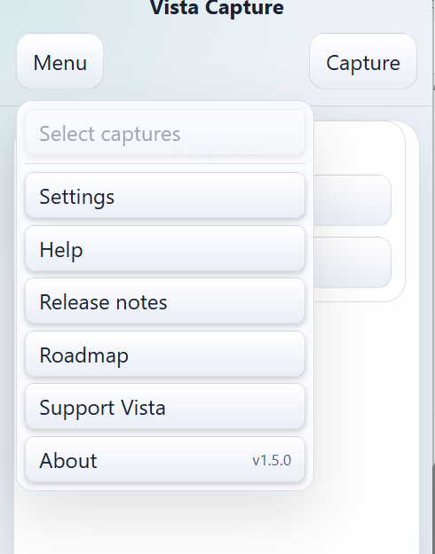
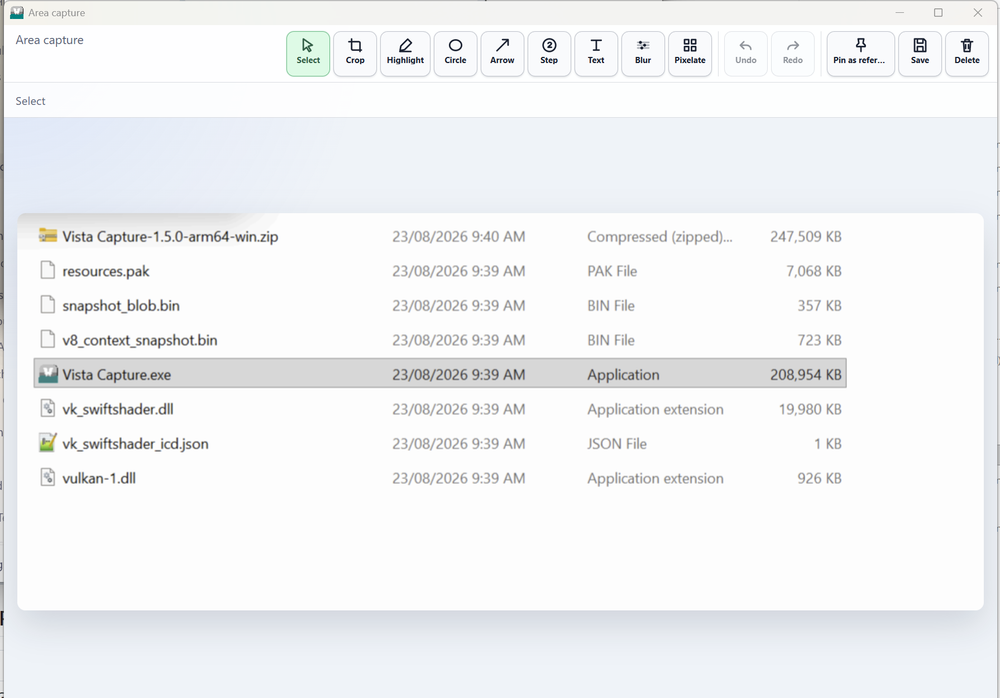
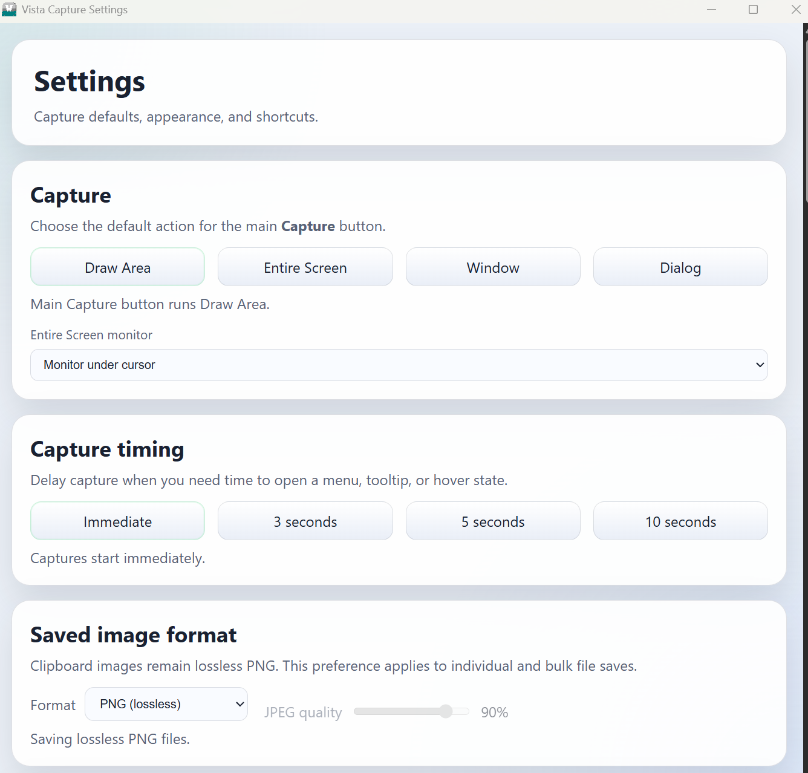
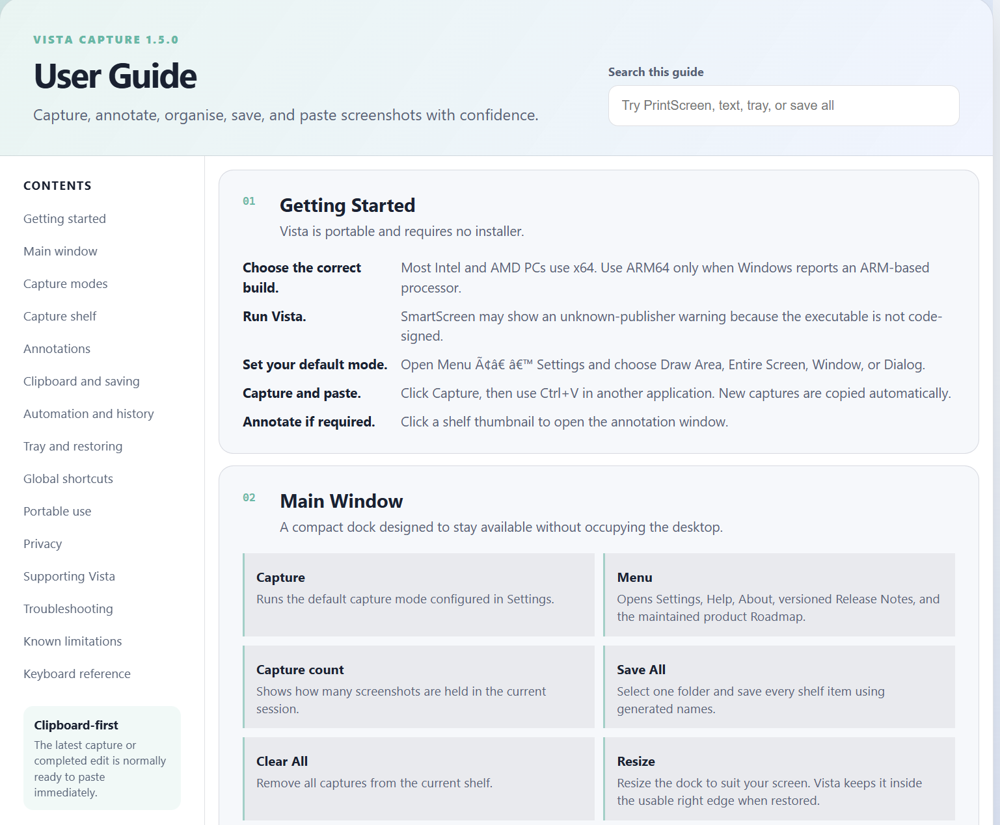
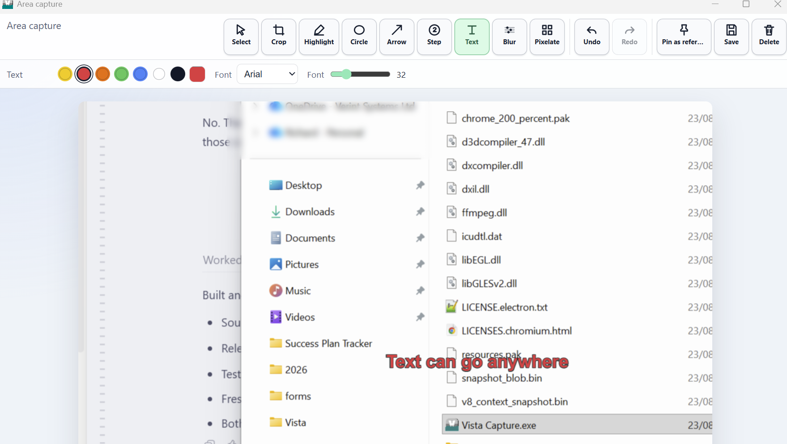
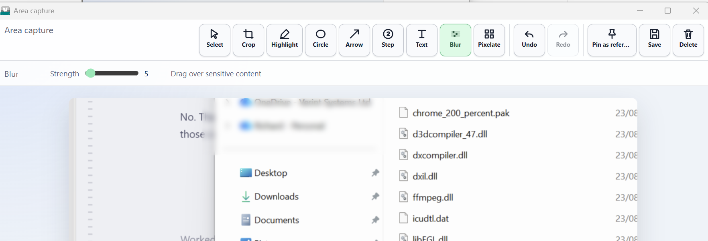
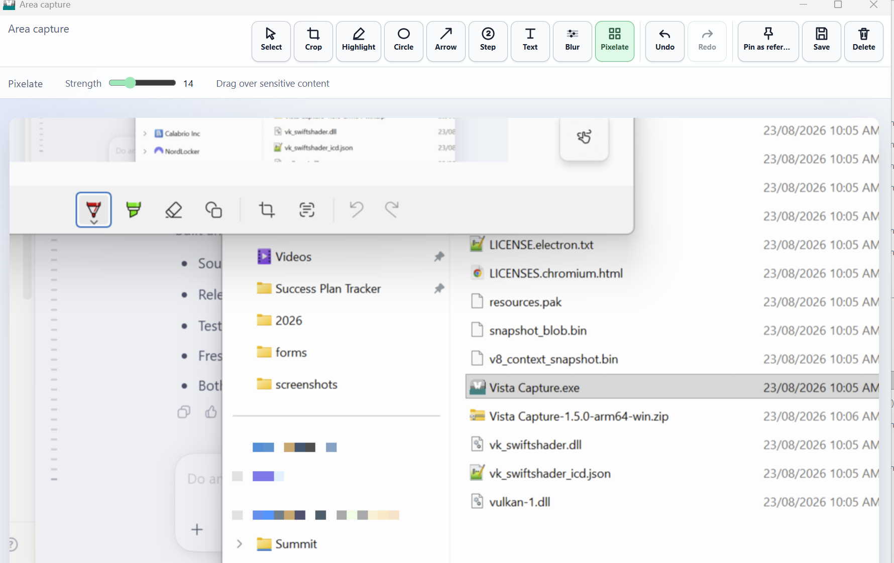

# Vista Capture

Vista Capture is a lightweight, portable screenshot and annotation application for Windows. It runs without installation and is available for both x64 and ARM64 systems. An optional per-user installer is also available for anyone who prefers a conventional setup.

## Download

Download the latest build from the [Releases page](https://github.com/RFLundgren/Vista-Release/releases/latest):

- **x64 portable EXE**: for most Windows PCs using Intel or AMD processors; run it directly, no installation.
- **x64 installer EXE**: optional conventional setup with a Start Menu shortcut and uninstaller. Installs to your user profile only; no administrator access required.
- **ARM64 portable EXE**: single-file portable option for Windows PCs using an ARM processor, including supported Snapdragon devices.
- **ARM64 installer EXE**: optional conventional setup for ARM64, with the same no-administrator, per-user install as the x64 installer.
- **ARM64 ZIP**: alternative folder-based portable build; extract the complete folder, then run Vista Capture.exe.

If you are unsure, open **Settings > System > About** in Windows and check **System type**.

## Using Vista Capture

1. Download the build that matches your computer.
2. **Portable:** place the portable executable in your preferred folder, or extract the complete ARM64 ZIP to that folder, then run it directly. **Installer:** run the setup EXE; it installs to your user profile only and adds a Start Menu and desktop shortcut. Neither option requires administrator access.
3. Use **Menu > Settings** to choose a default capture mode and configure global shortcuts.

Vista Capture can capture an entire display, a window, a dialog, or an area drawn with the mouse. New captures are copied automatically to the Windows clipboard and held on a compact shelf for quick reuse.

## Screenshots

<table>
  <tr>
    <td align="center"> Compact window - light</td>
    <td align="center"> Compact window - dark</td>
    <td align="center"> Application menu</td>
  </tr>
  <tr>
    <td align="center"> Capture editor</td>
    <td align="center"> Settings</td>
    <td align="center"> Help</td>
  </tr>
  <tr>
    <td align="center"> Text annotation</td>
    <td align="center"> Blur tool</td>
    <td align="center"> Pixelate tool</td>
  </tr>
</table>

## Features

- Portable Windows application with no installation required, or an optional per-user installer for a conventional setup.
- Native x64 and ARM64 builds.
- Entire-screen, window, dialog, and drawn-area capture modes.
- Configurable Draw Area overlay with preset or custom colours, adjustable opacity, live preview, and pixel-safe isolation.
- A dock icon toggle arms and disarms delayed capture in one click, remembers the last duration used, and by default automatically returns to instant after one delayed capture.
- Configurable global shortcuts and PrintScreen support where Windows and keyboard firmware permit it.
- Automatic clipboard copying after capture and editing.
- Annotation tools for highlights, circles, text, crop, arrows, numbered steps, blur, and pixelation.
- Undo, redo, individual saving, bulk saving, Menu-based multi-select actions, and a per-thumbnail close button to remove a single capture from the shelf.
- PNG and JPEG export options.
- Optional automatic saving with configurable filename templates.
- Optional local capture history with count, size, and age limits.
- Resizable always-on-top pinned references with opacity control.
- Preferred monitor selection for full-screen captures.
- Optional privacy-conscious update checks.
- Drag captures directly into Explorer and compatible applications.
- Optional portable data mode stores settings and history in a VistaData folder beside the executable.
- Closing the dock window sends it to the system tray instead of quitting, matching minimize; use the tray menu's Quit command to fully close Vista Capture.
- Optional Stripe support links with locally controlled reminders.
- Light, dark, and follow-system appearance modes.
- Comprehensive Help, Release Notes, and Roadmap windows inside the application.

## Portable Data and Privacy

Vista Capture works locally and does not require an account or cloud service. Screenshots are not uploaded by the application. Preferences and any capture history you explicitly enable are stored in your Windows user profile in either distribution.

**Portable:** to update, quit Vista Capture using the tray menu's **Quit** command (closing the dock window alone sends it to the tray rather than exiting). Replace the portable executable, or replace the extracted ARM64 application folder, then start the new build.

**Installer:** run the new version's installer over the existing install to update in place, or use Windows' **Apps & Features** to uninstall.

## Windows Security Notice

The portable and installer builds are currently unsigned. Windows SmartScreen may therefore display an **Unknown publisher** warning. Download Vista Capture only from this repository's official Releases page.

## Current Version

**Vista Capture v1.6.7**

### Highlights

- Added optional per-user installer builds for x64 and arm64 alongside the existing portable executables. The installer requires no administrator access, installs to the current user's profile, and adds a Start Menu and desktop shortcut with a standard uninstaller. The portable build remains the primary, recommended download.
- A dock icon toggle arms and disarms delayed capture in one click without opening Settings, remembers the last duration used, and offers 3, 5, or 10 seconds from a small popover. It defaults to automatically returning to instant after one delayed capture; Settings can keep it on instead.
- Each capture shelf thumbnail now has a close button to remove a single capture without entering multi-select mode.
- Closing the dock window sends it to the system tray instead of quitting, matching minimize. The tray menu's Quit command still fully exits.
- Save All and Clear All sit side by side in the docked shelf toolbar for a more compact layout.
- The portable launcher's self-extraction folder is pinned to a fixed name, so relaunching no longer accumulates duplicate tray icons under Windows Settings > Other system tray icons.

### SHA-256 Checksums

- `Vista Capture-1.6.7-x64-portable.exe`: `ACCA0C7DF9A978DBE7E9C3D4321C99986BF5ADCEEBC82B64EC7EEE2DEE299186`
- `Vista Capture-1.6.7-x64-setup.exe`: `3CDC98D2D6CAFDCB39891EEFD49AB69138A60DB0F8ECE4AF4BDA78D7DD0191E6`
- `Vista Capture-1.6.7-arm64-portable.exe`: `23C5698BA117E4E79A0444B08C9F0FE8BCB466D0155556E47E74B5BC6039A9EE`
- `Vista Capture-1.6.7-arm64-setup.exe`: `ED4DD547263BC42C17D5D7390C4BFBD81AACDE2267EFF9F55243C435AAEA7724`
- `Vista Capture-1.6.7-arm64-win.zip`: `77A842E470201B41C42C928D41F255F5D3C5AB28B86FAC2B47638BA3D8451196`
